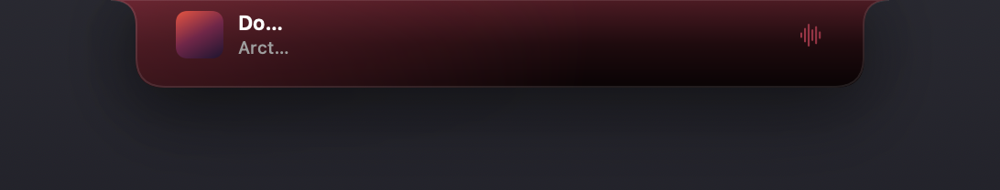
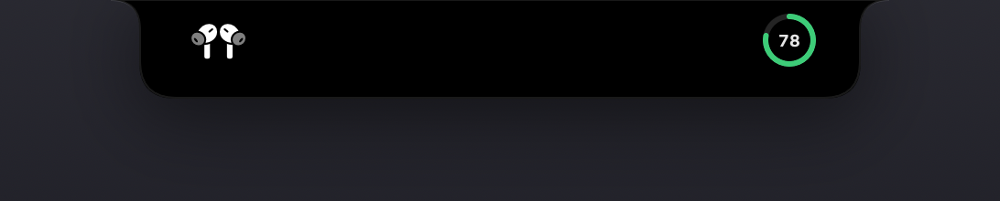

# Cornice

A media surface that lives in the MacBook notch.

Cornice turns the notch into a player. At rest it is invisible. Move the pointer
onto it and it grows out of the cut-out — album art, track, artist — and opens
into a full transport with a draggable scrubber, a spectrum that follows the
actual audio, timers, and system stats.

It never takes focus. Clicking it does not pull you out of what you were doing.




---

## Contents

- [The interaction](#the-interaction)
- [Reading what's playing](#reading-whats-playing)
- [The visualiser](#the-visualiser)
- [Notch geometry](#notch-geometry)
- [Architecture](#architecture)
- [Concurrency](#concurrency)
- [Reliability](#reliability)
- [Security and privacy](#security-and-privacy)
- [Performance](#performance)
- [Installing](#installing)
- [Developing](#developing)
- [Testing](#testing)
- [Limitations](#limitations)
- [Roadmap](#roadmap)

---

## The interaction

Three states, one object. Not three views that swap — a single shape whose
size and corner radii interpolate, so it reads as one thing growing rather than
one thing replacing another.

| | |
|---|---|
| **Resting** | Exactly the notch. Album thumbnail on one side, title or live spectrum on the other. Shows nothing at all when nothing is playing. |
| **Peek** | Triggered the instant the pointer arrives, with no delay. Art, title, artist. |
| **Open** | The full player, plus timers and stats. |
| **Activity** | A transient announcement — AirPods connecting, for instance. Event-driven, self-dismissing after 3.5s. |




### Why it feels immediate

The first version of this resized the `NSWindow` in step with the SwiftUI
animation. That is the obvious approach and it is the wrong one: the window
server and SwiftUI each animate a different thing on a different cadence, and
the result stutters and lags half a frame behind the pointer no matter how the
curves are tuned.

The fix was to stop moving the window at all.

- **The window is created once at its maximum size and never resized.** All
  motion happens inside a stable rectangle, in SwiftUI, at display rate.
- Because that window is much larger than what is visible, `hitTest` returns
  `nil` for anything outside the currently drawn shape, so it does not swallow
  clicks meant for the desktop underneath.
- Hover is computed from `mouseMoved` against that same shape rather than from
  the window's bounds — one source of truth for what is drawn, what is
  clickable, and what counts as hovering. When those were computed separately,
  the interactive region drifted out of step with the visible one mid-animation.
- **Peek responds with zero delay.** A dwell timer with nothing happening during
  it feels broken however short it is. Responding instantly and *then* committing
  to the full panel makes the same total duration feel immediate.

Springs are tuned deliberately: opening overshoots slightly (0.38s response,
0.76 damping) so it arrives with weight; closing is faster and more damped
(0.30s, 0.86) because a dismissal that bounces reads as indecision. The surface
never overshoots upward — it is anchored to the top edge of the screen, and a
bounce past that edge looks like it has come unstuck from the hardware.

---

## Reading what's playing

Cornice talks to **Apple Music and Spotify through macOS's own scripting
interfaces**. It uses no private frameworks.

That decision is worth explaining, because the obvious route is closed.
`MediaRemote` is the private framework that reports system-wide Now Playing
state, and it is what most notch utilities use. **Since macOS 15.4, Apple gates
it on the caller's platform signature**: an ordinary third-party app gets an
empty dictionary back. Verified on this machine, running macOS 26.1 — the
callback fires and returns zero keys.

The known workaround is to load a helper library into `/usr/bin/perl`, which is
Apple-signed with a `com.apple.` identifier and therefore passes the check. It
works, and it is what the apps in this category do. It is also, structurally,
loading your code into a system binary to inherit privileges it was granted and
you were not — so this project does not do it.

What the supported path gives up: browser audio. A YouTube tab is invisible to
it. What it gains: full metadata and artwork, real transport control
(play/pause, skip, seek, shuffle, repeat, volume), no private API that breaks on
the next macOS release, and a binary that can be notarized without qualification.

The provider sits behind a `MediaControlling` protocol, so a MediaRemote-backed
provider can be added later without touching anything above it.

Everything that differs between the two players is normalised in one place,
because each difference produces a plausible-looking but wrong UI:

- Spotify reports track duration in **milliseconds**, Apple Music in seconds.
- Spotify exposes an artwork URL; Music only hands over raw image data.
- Music spells repeat as `off`/`one`/`all`; Spotify uses a boolean.
- Both report volume 0–100, not 0–1.
- AppleScript renders reals in the **user's locale**, so a comma-decimal machine
  returns `182,813` — parsed naively, the playhead sits at zero for a large part
  of the world.

The player is polled on the order of once a second while the panel is open, but
the scrubber redraws every frame: the playhead is extrapolated locally from the
last known position and corrected when a real sample lands. That is the
difference between a scrubber that glides and one that ticks — and it is also
what lets the poll rate drop sharply when the panel is closed without anything
looking stale.

---

## Wireless devices

Connecting AirPods switches the Mac's default audio output, and Core Audio posts
a property-change notification when that happens. That is the whole detection
mechanism: event-driven, instant, and needing **no Bluetooth permission and no
Bluetooth framework** — which the obvious CoreBluetooth approach would have
required, for strictly less reliable results.

The surface announces the device with a glyph that turns once in 3D
(`rotation3DEffect` with perspective, so it reads as an object rotating rather
than an image being squeezed) and a charge ring, then dismisses itself. Battery
level is read from `AppleDeviceManagementHIDEventService` in the IO registry —
properties only, no private calls — and the ring is simply omitted when the
device does not report one, which is normal for non-Apple headphones and for the
first second after connecting.

An announcement never steals a panel you have open: if the surface is already
expanded, the device is recorded and the announcement is skipped.

The transport row also carries a permanent output-device control, because with
wireless audio "where is this actually playing?" is a genuine question, and the
glyph tracks the current transport — laptop, headphones, or AirPlay.

## The visualiser

The spectrum is a real FFT of the audio your Mac is playing, not an animation on
a timer.

Audio is captured with a **Core Audio process tap** (`AudioHardwareCreateProcessTap`,
macOS 14.2+) — the public API Apple added for exactly this. The alternatives are
worse: a virtual audio device needs an installer and a reboot and permanently
alters your audio chain, and ScreenCaptureKit's audio capture demands full Screen
Recording permission — the right to read your screen — in order to read a waveform.

The chain: tap → mono mixdown → Hann window → vDSP real FFT → log-spaced bands →
asymmetric smoothing → energy-based onset detection.

Decisions that matter:

- **Log-spaced bands**, because pitch is logarithmic. Linear bands put six of
  eight bars above 10 kHz where there is no energy.
- **Asymmetric smoothing** — fast attack, slow release. Symmetric smoothing
  looks either sluggish on transients or jittery on decay; the asymmetry is what
  makes bars look locked to the music.
- **Peak rather than mean within each band**, so a narrow tone moves its bar
  fully instead of being averaged into nothing by the silent bins beside it.
- **A refractory period on beat detection**, so one kick drum does not fire on
  six consecutive frames.
- Analysis happens in the audio callback and writes into a lock-protected box;
  the UI *pulls* the latest frame on its own display timer. Pushing observable
  updates from the audio thread would schedule main-actor work faster than it
  drains and stutter the entire interface.

It is **off by default** and asks for system-audio permission only when you turn
it on, at which point Settings explains what it does. When it is off, the bars
are not drawn at all — a visualiser sitting at a resting height looks broken,
and animating it without audio behind it would misrepresent what the app knows.

---

## Notch geometry

The notch is **measured on the display it is on**, not looked up from a table of
Mac models.

The notch is a fixed number of physical pixels, but macOS reports displays in
points, and the points-per-pixel ratio changes whenever you pick a different
scaled resolution in Displays settings. The same MacBook therefore reports a
different notch size in points depending on a setting you can change at any time.

Concretely: the machine this was built on is a `Mac15,12` running a scaled
1710 pt mode, and `NSScreen` reports its notch as **209 × 38 pt**. Published
per-model tables list figures in the 165–184 pt range, measured at default
scaling. Neither is wrong — the point size simply is not a property of the model.

Three paths, in order:

1. **Measured.** `NSScreen.auxiliaryTopLeftArea` and `auxiliaryTopRightArea`
   give the usable menu-bar strips either side of the notch. The gap between
   them *is* the notch, exactly, in the display's current point space. Available
   on every notched Mac from macOS 12, so this is the path that runs.
2. **Derived.** Some configurations — a mirrored notched panel in particular —
   report a top safe-area inset without the auxiliary areas. The inset is still
   an exact height, so width comes from a measured aspect ratio rather than an
   invented per-model constant.
3. **Synthetic.** No notch: external displays, Intel laptops, desktop Macs. A
   notch-shaped region is reserved in the centre of the menu bar and everything
   else behaves identically.

Implausible measurements are rejected rather than trusted: a zero-width gap is
not a notch, and a gap spanning a third of the display would place a window
across the whole menu bar. Geometry is re-resolved on display attach/detach,
resolution and scaling changes, rotation, and wake from sleep.

The machine is identified separately: `hw.model` from sysctl immediately, then
marketing name and chip once from `system_profiler` off the main actor. The
About tab shows exactly what was detected and which path produced it.

---

## Architecture

Two targets. `CorniceKit` holds all the logic and imports no SwiftUI;
`CorniceApp` is the interface and holds no business logic.

```
Sources/
  CorniceKit/                 no SwiftUI, no NSScreen — fully unit-testable
    Media/                    models, AppleScript runner, per-player controller,
                              source selection and artwork cache
    Audio/                    Core Audio tap, vDSP FFT, spectrum + beat analysis
    Telemetry/                Mach/sysctl/IOKit probe
    Focus/                    countdown state machine and timer board
    Settings/                 Preferences, atomic file store
    Notch/                    ScreenMetrics, geometry resolver, model catalog
    Process/                  subprocess runner with timeout and cancellation
    Support/                  errors, Loadable, logging, redaction, formatting
  CorniceApp/
    Window/                   NSPanel, surface geometry, hit testing, hot key
    Design/                   theme tokens, the morphing surface shape
    Model/                    AppModel, actions, services, artwork palette
    Views/                    the three states, panes, settings, docs capture
```

**One geometry type.** `SurfaceGeometry` computes the surface's rect for each
state and is used by both the renderer and the hit-tester. This is the single
most bug-prone seam in a shape-shifting window, and it has exactly one owner.

**Service protocols, not concrete types.** `MediaControlling`,
`TelemetryProbing`, `PreferencesPersisting`, `ProcessRunning`. The payoff is
`PreviewServices`: the whole app runs against scripted data with no change to
any view. That is what renders the images in this README, and what lets the
tests cover a paused player or a refused permission without arranging one.

**`NSScreen` is read in exactly one place.** `ScreenBridge` converts it to a
plain `ScreenMetrics` value, so every awkward display configuration is a test
fixture rather than something needing four different MacBooks.

---

## Concurrency

Swift 6 language mode with strict concurrency checking across both targets.

- **AppleScript is confined to one serial queue.** `NSAppleScript` is neither
  thread-safe nor `Sendable`; the raw `NSAppleEventDescriptor` never leaves that
  queue — results are reduced to plain values at the boundary.
- **Audio never touches the main actor.** Analysis runs in the Core Audio
  callback; the UI pulls the result on its own timer.
- **One display timer for the whole UI**, not one per component — 60 Hz while
  open, 12 Hz while resting. Three separate timers would wake the main thread
  three times as often for the same result.
- **Subprocess execution** resolves a three-way completion handshake (stdout
  EOF, stderr EOF, process exit) under one lock, reads pipes off the cooperative
  pool to avoid deadlocking it, and escalates SIGTERM → SIGKILL on timeout.
- **Time is injected, never read implicitly.** Every countdown and the playhead
  derive from a passed-in instant, which is what makes "pause for an hour, then
  resume" and "sleep through the deadline" testable at all.

---

## Reliability

| Condition | Behaviour |
|---|---|
| No player running | Surface stays invisible; panel says so plainly |
| Player open, nothing loaded | Treated as a normal state, not an error |
| Automation permission refused | Explained in-panel with a link to Settings and a retry; polling stops rather than re-prompting |
| Spotify and Music both open | Whichever is *playing* wins; if neither, the last shown source is held so pausing does not make the panel jump |
| Player quits mid-track | Next poll finds nothing; surface returns to resting |
| Artwork fetch fails | Placeholder art; nothing else is affected |
| Audio permission denied | Visualiser reports it and stays off; the player works normally |
| Output device changes | The tap reports its own sample rate; bands are rebuilt so frequencies stay put |
| Playback paused | Bars decay to rest instead of freezing mid-spectrum |
| Preferences corrupted | Quarantined with a timestamp, defaults loaded, app still launches |
| Preferences missing newer keys | Decoded field by field; absent keys take defaults |
| Mac without a notch | Synthetic centred region; identical behaviour |
| Display or scaling changes | Geometry re-measured and the surface repositioned |

---

## Security and privacy

- **No private frameworks.** No MediaRemote, no injection into Apple binaries,
  no SIP changes.
- **Audio is analysed in memory and discarded.** Never written to disk, never
  transmitted. The tap is created `.unmuted` (playback is unaffected) and
  `isPrivate` (it does not appear in other apps' device lists).
- **Two permissions, both explained, both optional.** Automation, to read and
  control your players. System audio recording, only if you turn the visualiser
  on. Nothing else — no camera, microphone, location, contacts, or full disk.
- **The global hot key uses Carbon's `RegisterEventHotKey`** specifically to
  avoid needing Accessibility permission, which would mean the right to read
  every keystroke you type in order to open a panel.
- **No network access except album artwork** fetched from the URL the player
  itself supplied, size-capped and content-type-checked.
- **No analytics, no telemetry upload, no account.**
- Logs never contain track contents or paths outside a redacted home directory.

---

## Performance

Measured, not estimated. `./Scripts/measure.sh` produces these numbers.

Release build on a MacBook Air (M3, 8 GB), macOS 26.1. Music playing, surface
resting, visualiser off, sampled after the app had settled:

| | |
|---|---|
| CPU, mean | **0.41%** of one core |
| CPU, peak | 9.0% |
| Memory (RSS), mean | **16.6 MB** |
| Memory (RSS), peak | 22.2 MB |

That took three rounds of profiling to reach. The first working version measured
**9.9% mean CPU** — sixteen times worse — and `sample` put the cost in two
places, both of which are worth describing because neither was obvious.

Memory is a few megabytes higher than it needs to be, deliberately: all four
content layouts are kept built and cross-faded rather than constructed on
demand, because building the player *during* the expand animation is what made
opening hitch. That trade is described under the interaction section.

**The frame timer ran whenever music played.** It was driving repaints at 12 Hz
for a *collapsed* surface showing album art and a title, neither of which
changes between tracks. It now runs only when something genuinely moves: the
spectrum while capture is on, a running countdown, or the scrubber while the
panel is actually open. Resting with the visualiser off, there is no timer at
all.

**Polling a music player is expensive.** Neither player supports reading a
track's properties as a single record — Spotify raises outright on
`properties of current track` — so every property is its own Apple event, and
profiling put one Spotify round-trip at roughly **100 ms of CPU**, almost all
of it inside `OSAExecute` waiting on Spotify's own scripting handler. Two
changes followed:

- **Two-tier reads.** The frequent poll fetches only what changes between polls
  — state, playhead, volume, and the title as a change signal. Full metadata is
  read only when the track actually moves on, which more than halves the
  steady-state cost.
- **Cadence follows visibility.** Open, polling runs at the configured rate.
  Resting, it drops to 4s while playing and 8s while paused — and the resulting
  staleness is invisible, because hovering forces an immediate refresh that
  completes while the peek animation is still running.

The rest:

- **Telemetry backs off** from 2s to 15s when the panel is closed.
- **Artwork is fetched once per track**, keyed on an identity that deliberately
  ignores the playhead — otherwise every poll would look like a new song and the
  cover would reload continuously.
- **Kernel reads, not subprocesses**, for CPU, memory, network and battery.
- **In-process `NSAppleScript`**, compiled once and reused, rather than spawning
  `osascript` every second.

---

## Installing

Requires macOS 14 or later (14.2+ for the visualiser). A notch is not required.

```bash
git clone <this repository>
cd Cornice
make app
open dist/Cornice.app
```

Cornice has no Dock icon. It lives in the notch, with a menu-bar item for
settings and quitting.

On first use macOS will ask to let Cornice control Music and Spotify. That is
the automation permission it needs to read and control playback; without it the
panel explains what is missing and links to the right settings pane.

Builds produced locally are ad-hoc signed — enough to run on the machine that
built it, but **not notarized**. A DMG from an unsigned build shows a Gatekeeper
warning on another Mac and needs right-click → Open on first launch. Signing and
notarization are wired into the release workflow and activate when Developer ID
secrets are present. Nothing here fakes a signature it does not have.

---

## Developing

```bash
make build         # swift build
make test          # swift test
make app           # assemble dist/Cornice.app (release)
make run           # build, assemble, and launch
make measure       # sample idle CPU and memory of the running app
```

The app must run from a bundle: `LSUIElement`, the usage-description strings
behind both permission prompts, and `SMAppService` all depend on it.

Two diagnostic modes:

```bash
./dist/Cornice.app/Contents/MacOS/Cornice --probe-media
./dist/Cornice.app/Contents/MacOS/Cornice --capture-docs Docs/images
```

`--probe-media` prints exactly what the media layer can see — which players are
running, the parsed snapshot, and whether artwork resolved. `--capture-docs`
regenerates the README images by rendering the real view hierarchy through
`ImageRenderer` against `PreviewServices`, so they are reproducible on any
machine and need no Screen Recording permission.

Watch what the app is doing:

```bash
log stream --predicate 'subsystem == "dev.cornice.app"' --level debug
```

---

## Testing

106 test methods across 8 files. Run with `make test`.

What is covered, and why each earns its place:

- **Player reply parsing** — the millisecond/second mismatch, locale-dependent
  decimals, volume normalisation, a stopped player, and titles containing pipes,
  tabs and quotation marks (which is why the field separator is non-printable).
- **Playhead extrapolation** — that it advances while playing, does not while
  paused, clamps to the track length after a long sleep, and that track identity
  ignores the playhead so artwork is not refetched on every poll.
- **Source selection** — a playing source beats a paused one, selection is
  stable while everything is paused, stopped players are skipped, and a refused
  permission is recorded once and resettable.
- **FFT** — a pure tone lands in the bin its frequency predicts, a higher tone
  moves the peak up, silence produces no magnitude, and short or empty buffers
  are tolerated rather than trapping in the audio callback.
- **Spectrum analysis** — 60 Hz lands in the low bands and 9 kHz in the high
  ones, louder input reads higher, silence settles to rest, and the compression
  curve is concave so quiet passages still move the bars.
- **Beat detection** — periodic kicks register, the refractory period stops one
  kick firing repeatedly, and a sustained tone is not mistaken for a beat.
- **Timers** — pause across arbitrary real time, completion reported exactly
  once, and a Mac that slept through the whole countdown.
- **Notch geometry** — every display configuration described above, including
  the two that cannot be reproduced without extra hardware.
- **Preferences** — clamping, corruption quarantine, `0600` permissions, and
  field-by-field decoding so a file written before a setting existed still loads.
- **Subprocess execution against real processes** — timeout termination,
  cancellation, output capping, and sixteen concurrent commands not deadlocking.

External dependencies are mocked throughout. No test needs a running music
player, a listening socket, or audio permission.

---

## Limitations

- **Apple Music and Spotify only.** Browser audio and other players are
  invisible, for the reason described above.
- **Not notarized.** Builds are ad-hoc signed.
- **The visualiser needs macOS 14.2** and a permission grant.
- **The hot key is fixed** at ⌥⌘D and not yet rebindable.
- **Pane heights are fixed**, so switching tabs does not resize the surface — a
  pane with little content has visible empty space.
- **One display.** The surface lives on the built-in notched screen, not on each
  display in a multi-monitor setup.
- **No lyrics, queue, or library browsing.** This is a control surface, not a
  music client.
- **No clipboard history or colour picker.** Both were in scope early and cut: a
  permanently running clipboard reader is a meaningful privacy surface, and
  neither has anything to do with what this app is for.
- **No localisation.** English only.
- **No lock-screen presence.** macOS has no third-party lock-screen widget API,
  so the surface exists only while you are logged in and the screen is unlocked.

---

## Roadmap

1. Rebindable keyboard shortcuts.
2. Per-display surfaces.
3. An optional MediaRemote provider, for users who choose to install the adapter
   themselves — behind the existing protocol, off by default, clearly labelled.
4. AirPlay and output-device switching from the panel.
5. Signed and notarized releases.

---

## Prior art

Cornice was written from scratch. Notch-resident utilities for macOS are an
established category, and reading open-source projects to understand `NSPanel`
behaviour around the notch is exactly what they are for:

- [Atoll](https://github.com/Ebullioscopic/Atoll) — the closest reference for
  what a notch surface should cover.
- [DynamicNotch](https://github.com/jackson-storm/DynamicNotch) — a SwiftUI +
  AppKit notch window, the same architectural stance taken here: native window
  and event handling rather than a web-style overlay.
- [rtaudio](https://github.com/ZephyrCodesStuff/rtaudio) — the C++ visualiser
  Atoll adapted. Cornice does not use it. The spectrum here is Swift on top of
  Accelerate's vDSP, which avoids a C++ dependency and a bridging layer, and
  runs the FFT on the vector units.

The differences that matter: no private frameworks, a fixed-window motion
architecture, and a visualiser driven by a Core Audio process tap.

`Docs/DESIGN-PROMPT.md` is a self-contained brief for regenerating this
surface's visual and motion design from scratch.

## Licence

MIT. See [LICENSE](LICENSE).
