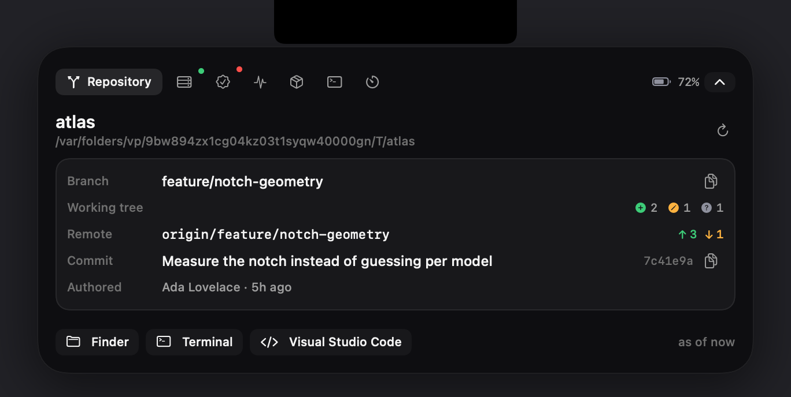
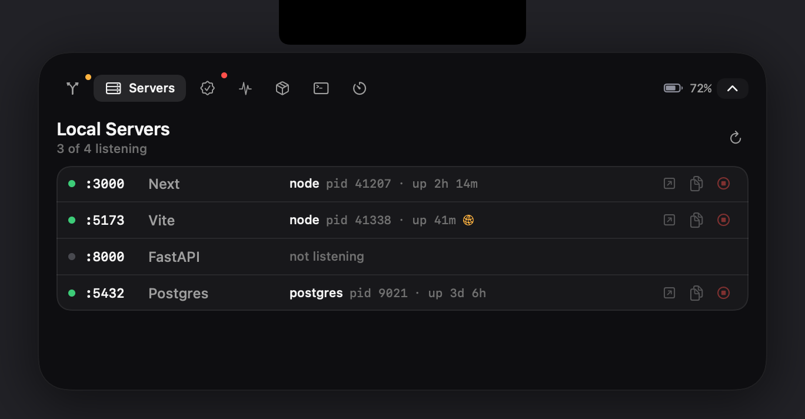
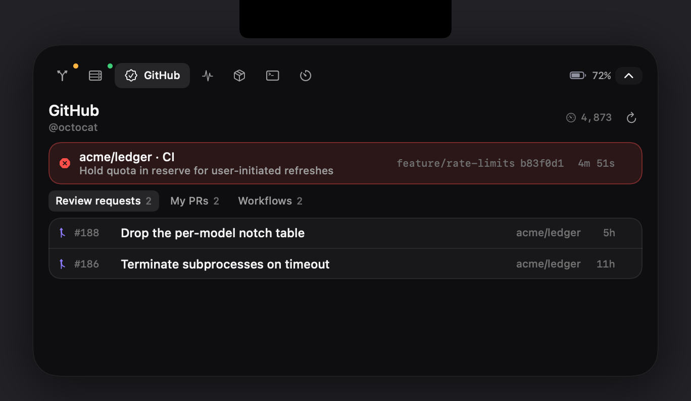
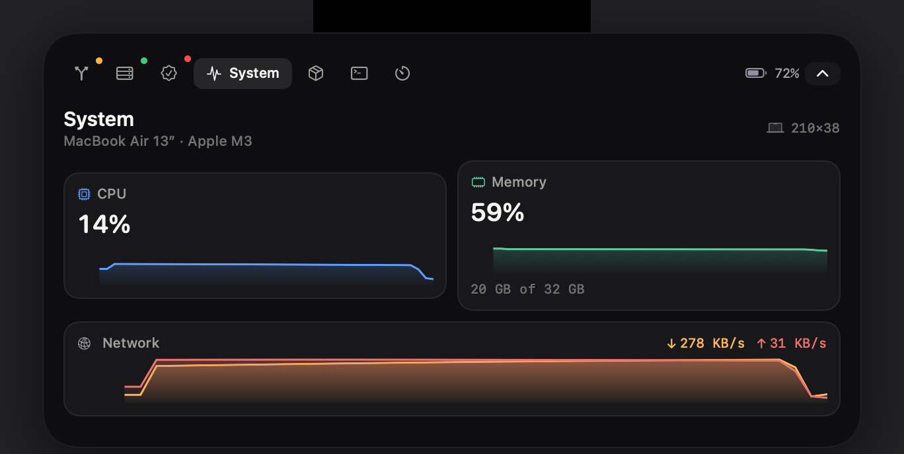
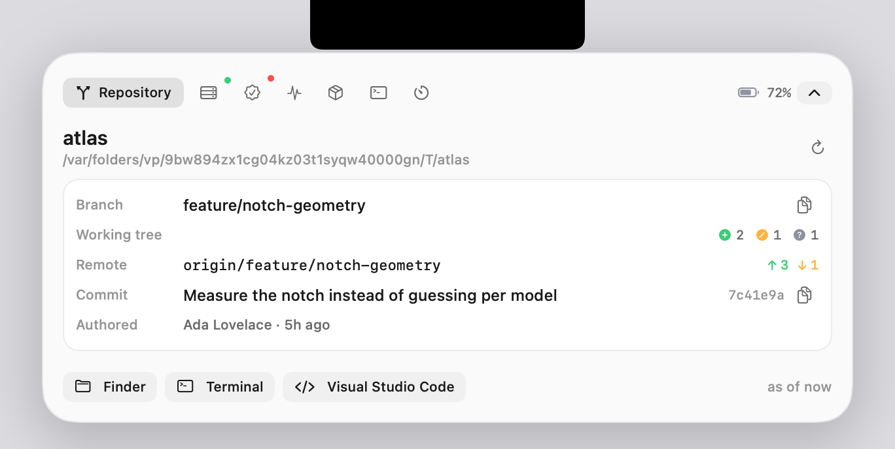

# Cornice

A developer command surface that lives along the top edge of your Mac.

Cornice sits in the MacBook notch. Collapsed, it shows the branch you are on and
the one thing that needs your attention. Hover or press ⌥⌘D and it opens into a
panel with local Git state, which dev servers are listening, GitHub pull requests
and CI results, container status, machine telemetry, and the handful of commands
you actually run — without leaving whatever you were doing.

It does not take focus. Clicking it never pulls you out of your editor.




---

## Contents

- [What it does](#what-it-does)
- [Notch geometry](#notch-geometry)
- [Architecture](#architecture)
- [Concurrency](#concurrency)
- [Reliability](#reliability)
- [Security](#security)
- [Performance](#performance)
- [Installing](#installing)
- [Developing](#developing)
- [Testing](#testing)
- [Limitations](#limitations)
- [Roadmap](#roadmap)

---

## What it does

### Repository

Current branch, ahead/behind counts against the upstream, and a working-tree
breakdown split into staged, modified, untracked and conflicted — not one lumped
"3 changes", because that number does not tell you whether you are about to
commit something you did not mean to. Copy the branch name or commit hash, or
open the repository in Finder, your terminal, or your editor.

Detached HEAD, a repository with no commits, a branch with no upstream, and a
directory that has been deleted underneath you are all distinct states with
distinct displays.

### Local servers



Which of your configured ports are listening, what process holds each one, its
pid, and how long it has been up. Open or copy the localhost URL, or stop the
server — with a confirmation that names the process and sends SIGTERM rather
than SIGKILL, so it gets to shut down cleanly.

A server bound to every interface rather than to loopback is flagged, because
that is rarely what anyone intends for a dev server.

All monitored ports are resolved with **one** `lsof` invocation, so watching
eight ports costs the same as watching one.

### GitHub



Pull requests waiting on your review, your own open pull requests, and the most
recent workflow run per watched repository. A failing check is pulled out of the
list and shown above it — that is the one thing worth interrupting for.

Responses are cached and revalidated with ETags, and the client holds a quota
reserve so background refreshes cannot starve an action you took deliberately.

### System



CPU, memory, network throughput and battery, read directly from Mach and sysctl
rather than by shelling out to `top`. Enough context to know whether the machine
is pegged while a build runs. It is not trying to be Activity Monitor.

### Containers, commands, focus

Docker containers with their published ports, and stop/restart behind a
confirmation. A small set of commands you configure yourself. A focus timer that
is a timer and nothing more — no streaks, no history, no productivity system.

Light mode is supported throughout; the collapsed surface stays black because it
is sitting against a physical hole in the display.



---

## Notch geometry

The notch is **measured on the display it is on**, not looked up from a table of
Mac models. This matters more than it sounds like it should.

The notch is a fixed number of physical pixels, but macOS reports the display in
points, and the points-per-pixel ratio changes whenever you pick a different
scaled resolution in Displays settings. The same MacBook therefore reports a
different notch size in points depending on a setting the user can change at any
time — which makes a hardcoded per-model point size wrong for everyone not on
the default scaling.

Concretely: the machine this was developed on is a `Mac15,12` running a scaled
1710 pt mode, and `NSScreen` reports its notch as **209 × 38 pt**. Published
tables for that model list figures in the 165–184 pt range, measured at default
scaling. Neither is wrong; the point size simply is not a property of the model.

Resolution proceeds in three steps:

1. **Measured.** `NSScreen.auxiliaryTopLeftArea` and `auxiliaryTopRightArea`
   report the usable menu-bar strips either side of the notch. The gap between
   them *is* the notch, exactly, in the display's current point space. Available
   on every notched Mac from macOS 12 onward, so this is the path that runs.
2. **Derived.** Some configurations — a mirrored notched panel, in particular —
   report a top safe-area inset without the auxiliary areas. The inset is still
   an exact *height*, so the width comes from a measured aspect ratio rather than
   an invented per-model constant.
3. **Synthetic.** No notch at all: external displays, Intel laptops, desktop
   Macs. A notch-shaped region is reserved in the centre of the menu bar and the
   rest of the app is identical.

Implausible measurements are rejected rather than trusted: a zero-width gap is
not a notch, and a gap spanning a third of the display would place a window
across the whole menu bar.

Geometry is re-resolved on display attach/detach, resolution and scaling
changes, rotation, and wake from sleep — several of which change the notch's
point size without any hardware changing.

The machine is identified separately, for display: `hw.model` via sysctl (cheap,
available immediately), with the marketing name and chip fetched once from
`system_profiler` off the main actor. The **About** tab shows exactly what was
detected and which of the three paths produced it, so a placement bug can be
reported with real numbers.

> On the machine this was developed on, the app logs:
> `geometry: measured 209×38 pt (r10) at x=751, 12.2% of 1710 pt display`
> and identifies it as `MacBook Air 13″ · Apple M3`.

Because the notch's point size is not comparable across machines, the only
cross-machine figure the app reports is its width as a **fraction of display
width**, which is scaling-invariant.

---

## Architecture

Two targets. `CorniceKit` holds all the logic and imports no SwiftUI;
`CorniceApp` is the interface and holds no business logic.

```
Sources/
  CorniceKit/                 no SwiftUI, no NSScreen — fully unit-testable
    Support/                  errors, Loadable, logging, redaction, formatting
    Process/                  Command, SubprocessRunner, ToolLocator, scripted double
    Git/                      porcelain=v2 parser, GitService
    Ports/                    lsof field parser, PortMonitor
    Telemetry/                Mach/sysctl/IOKit probe
    GitHub/                   models, client, ETag cache, rate-limit gate
    Credentials/              Keychain store behind a protocol
    Commands/                 CommandSpec validation, CommandRunner
    Docker/                   availability probe, output parser
    Focus/                    timer state machine
    Settings/                 Preferences, atomic file store
    Notch/                    ScreenMetrics, geometry resolver, model catalog
  CorniceApp/
    Window/                   NSPanel, hover tracking, Carbon hot key, screen bridge
    Design/                   theme tokens, notch and panel shapes
    Model/                    AppModel, actions, service container, system actions
    Views/                    SwiftUI panes, settings, docs capture
```

**Service protocols, not concrete types.** Every service the app model touches is
behind a protocol — `GitReading`, `PortMonitoring`, `TelemetryProbing`,
`DockerInspecting`, `CredentialStoring`, `PreferencesPersisting`,
`ProcessRunning`, `HTTPTransporting`. The payoff is visible in
`PreviewServices.swift`: the *entire application* runs against scripted data
with no change to any view, view model, or service. That is what generates the
screenshots in this README, and it is what lets the test suite cover a failing CI
run or an unhealthy container without needing one.

**One composition root.** `ServiceContainer` is a struct of `let` properties
built in `AppDelegate`. No registry, no resolver, no property-wrapper magic —
the app has about a dozen services and no need for runtime resolution.

**`NSScreen` is read in exactly one place.** `ScreenBridge` converts it to a
plain `ScreenMetrics` value. `NSScreen` cannot be constructed in a test, so
without this seam every awkward display configuration would be untestable; with
it, they are all fixtures.

**Wire types stay at the boundary.** GitHub's snake_case, its nullable
conclusions and its hyphenated enum values are confined to the decoding layer.
Unknown enum values decode to `.unknown` rather than throwing, so a new GitHub
status cannot empty the panel.

---

## Concurrency

Built with Swift 6 language mode and strict concurrency checking across both
targets. Services that hold mutable state are actors; the UI layer is
`@MainActor` throughout.

**Subprocesses.** The awkward part of running a process from Swift concurrency is
that stdout reaching EOF, stderr reaching EOF, and the process exiting all
finish independently, and the continuation must resume exactly once — after all
three, or after a timeout or cancellation pre-empts them. That bookkeeping is
isolated in one lock-guarded type. Pipe reads run on a dedicated dispatch queue,
**not** on the cooperative pool: `readDataToEndOfFile` blocks, and blocking
cooperative threads is what deadlocks a concurrency-heavy app. A test runs
sixteen concurrent commands to keep that honest.

Timeouts escalate SIGTERM → SIGKILL after a grace period. Cancellation
terminates the child. Output is capped so a runaway command cannot grow memory
without bound.

**Stale results.** `GitService` keeps a per-repository generation counter. Switch
repositories quickly — which is exactly what you do when hunting through
projects — and a slow `git status` on the previous repo would otherwise land
after the new one and repaint the panel under the wrong name. Results whose
generation is no longer current are discarded, and `AppModel` re-checks the
active path before committing a result.

**Cancellation is not failure.** `Loadable.resolve` treats a cancelled task as
"superseded", preserving the existing value instead of surfacing an error for
something the user never did.

**Coalescing.** `PortMonitor` joins an in-flight scan rather than starting a
second one, so a refresh tick arriving mid-scan cannot queue `lsof` behind
itself.

**Independent loops.** Each module has its own refresh task, so a hung Docker
daemon cannot stall the Git panel.

---

## Reliability

Every integration fails in its own pane and keeps its last good value.

| Condition | Behaviour |
|---|---|
| Repository directory deleted or unmounted | `invalidPath`, no retry offered (retrying cannot help) |
| Not a Git repository | `git`'s own stderr, truncated, shown in the pane |
| `git` not installed | Named as missing; other modules unaffected |
| Repository with no commits | Normal state — branch shown, "no commits yet" |
| Detached HEAD | `detached @ 9f2b3c4` rather than an empty label |
| Branch with no upstream | Tracking reported as unknown, not as "0 ahead, 0 behind" |
| Network lost | Cached GitHub data served, marked stale |
| GitHub rate limit exhausted | Requests refused locally until reset rather than sent to fail |
| Token expired or revoked | `unauthorized`, with no retry button |
| Docker not installed | Panel says so calmly; not treated as an error |
| Docker daemon stopped | Detected via `docker version`, negative result cached for 60s |
| Dev server disappears | Row flips to "not listening" on the next scan |
| Subprocess hangs | Terminated at its timeout, reported as `timedOut` |
| Preferences file corrupted | Quarantined with a timestamp, defaults loaded, app still launches |
| Preferences missing newer keys | Decoded field-by-field; absent keys take defaults |
| Mac without a notch | Synthetic centred region; identical behaviour |
| No display attached | Panel hidden until one returns |

Errors carry whether they are retryable, and the UI only offers "Retry" when
retrying could actually work — a retry button next to "git is not installed" is
a lie.

---

## Security

- **Tokens live in the Keychain**, as a generic password scoped to this app,
  marked `kSecAttrAccessibleAfterFirstUnlockThisDeviceOnly` — readable by
  background refreshes after one unlock, never synced to iCloud, never restored
  onto a different machine from a backup.
- **The token is never in observable state**, never in the settings file, never
  in a log, and never in an error message. It is read from the store for the
  duration of a request and discarded. A test asserts the settings file contains
  no token field and that a 401's message does not contain the credential.
- **Tokens are verified before being stored**, so a typo is reported immediately
  rather than becoming an empty panel later.
- **Where a log must identify which credential was involved**, it writes a
  one-way fingerprint (`ghp…(len:40,#a91f)`), never the value.
- **No shell anywhere**, except where a user explicitly configured one. Commands
  are `execve` with an argument array, so a branch named `; rm -rf ~` is an
  unusual branch name rather than a command.
- **Shell mode is opt-in per command**, and the exact script is shown verbatim
  and in full in the confirmation dialog. Nothing is interpolated into it — no
  repository name, no branch, no API response.
- **Nothing constructs, imports, downloads, or suggests a command.** Commands
  come only from the settings window. There is deliberately no "run the task
  defined in this repository" feature, because that turns cloning a repository
  into running its code.
- **Input that becomes part of a request path is validated.** Repository slugs
  are checked against GitHub's naming rules before interpolation; a slug of
  `../../admin` is dropped before it reaches the network, and a test asserts it.
  Container IDs are checked to be hex so they cannot be read as flags.
- **Destructive actions are confirmed**, naming the specific process, port, or
  container. Process termination is restricted to processes owned by the current
  user.
- **Paths never reach a shell.** Finder, terminal, and editor launches go through
  `NSWorkspace` with a file URL, so a directory name containing quotes or
  semicolons is the OS's problem rather than an escaping bug.
- **The settings file is written `0600`**, atomically.
- **No analytics, no telemetry upload, no network access at all** beyond
  `api.github.com`, and none of that until you connect a token.
- **No unnecessary permissions.** The global hot key uses Carbon's
  `RegisterEventHotKey` rather than an event monitor specifically to avoid
  requiring Accessibility permission — the permission that would let the app read
  every keystroke you type. No camera, microphone, location, contacts, or
  full-disk access is requested.
- CI fails the build if a credential-shaped string appears in the tree.

---

## Performance

Measured, not estimated. `./Scripts/measure.sh` produces these numbers; run it
yourself.

Release build on a MacBook Air (M3, 8 GB), macOS 26.1. Panel collapsed, app left
alone, sampled after it had settled — 60 samples over 180 seconds:

| | |
|---|---|
| CPU, mean | **0.21%** of one core |
| CPU, peak | 5.6% |
| Memory (RSS), mean | **10.6 MB** |
| Memory (RSS), peak | 14.0 MB |

Including the launch window, the same build averages 0.50% CPU and peaks at
53.9 MB RSS while SwiftUI and its rendering stack initialise, settling to the
figures above within about a minute.

Cold launch to display geometry resolved and the panel placed, timed from the
app's own log timestamps: **1.0 s cold, 0.52–0.59 s warm** across four runs.

How that is achieved:

- **Cadence follows visibility.** Telemetry samples every 2s while the panel is
  open and every 15s while it is collapsed, because a collapsed panel has no
  visible telemetry to update. Containers go from 10s to 45s.
- **Disabled modules stop entirely.** Turning a module off cancels its task
  rather than hiding its output.
- **One `lsof` for all ports**, and the follow-up `ps` for uptimes is skipped
  entirely when nothing is listening — the common case on an idle machine.
- **Kernel reads, not subprocesses.** CPU, memory, network, and battery come from
  `host_statistics`, `sysctl`, `getifaddrs` and IOKit. Spawning a process to read
  a number costs milliseconds; these cost microseconds.
- **Negative results are cached.** A stopped Docker daemon makes `docker ps`
  block for seconds before failing, so a failed probe is not repeated for 60s.
- **Redundant writes are skipped.** Settings views emit a change per keystroke;
  the store compares against the last written value, so dragging a slider does
  not rewrite the file every frame.

### GitHub request cost

The caching layer is measured by the harness against a scripted transport, which
lets the 304 path be exercised deterministically. Two mechanisms:

- **Freshness window.** Within it, a repeat request is answered from memory with
  no network round-trip. Measured: **6 refresh cycles produced 3 network
  requests** — the first cycle's three, and nothing after.
- **ETag revalidation.** Past the window, requests carry `If-None-Match`. GitHub
  answers unchanged resources with `304 Not Modified` **and does not decrement
  the rate limit**. Measured with the freshness window disabled to force
  revalidation: **3 of 6 requests were 304s**, costing no quota.

Since your open pull requests change far less often than the panel refreshes,
the steady state is dominated by 304s. On top of that, a `RateLimitGate` refuses
requests locally once quota is exhausted, and holds 50 requests in reserve so
background refreshes cannot starve a refresh you asked for.

*These are harness measurements against a scripted transport, not a benchmark
against live GitHub.*

---

## Installing

Requires macOS 14 or later. Apple silicon and Intel both work; a notch is not
required.

```bash
git clone <this repository>
cd Cornice
make app
open dist/Cornice.app
```

Cornice has no Dock icon. It appears in the notch, with a menu-bar item for
settings and quitting.

**First run:**

1. Open the panel (hover the notch, or ⌥⌘D).
2. **Settings → Repositories → Add Repository…** and pick any folder inside a Git
   repository; the repository root is resolved for you.
3. **Settings → Servers** to adjust the monitored ports.
4. **Settings → GitHub** to paste a personal access token
   ([create one](https://github.com/settings/tokens/new?scopes=repo&description=Cornice)
   with `repo`, or `public_repo` if you only need public repositories). It is
   verified, then stored in the Keychain.

Builds produced locally are ad-hoc signed. That is enough to run on the machine
that built it, but **not** notarized — a DMG from an unsigned CI build will show
a Gatekeeper warning on another Mac, and needs right-click → Open on first
launch. Signing and notarization are wired into the release workflow and activate
when the Developer ID secrets are configured; see
[`.github/workflows/release.yml`](.github/workflows/release.yml). Nothing here
fakes a signature it does not have.

---

## Developing

```bash
make build         # swift build
make test          # swift test
make app           # assemble dist/Cornice.app (release)
make app-debug     # assemble a debug bundle
make run           # build, assemble, and launch
make measure       # sample idle CPU and memory of the running app
make clean
```

The app must run from a bundle, not as a loose binary: `LSUIElement`, the
Keychain identity, user notifications, and `SMAppService` all depend on it, and
each fails confusingly without it.

Regenerate the README images after a design change:

```bash
./dist/Cornice.app/Contents/MacOS/Cornice --capture-docs Docs/images
```

That renders the real view hierarchy through `ImageRenderer`, fed by
`PreviewServices`. The images are the actual views with scripted data —
deterministic, reproducible on any machine, and produced without granting
anything Screen Recording permission.

Watch what the app is doing:

```bash
log stream --predicate 'subsystem == "dev.cornice.app"' --level debug
```

---

## Testing

163 test methods across 11 files, roughly 2,300 lines. Run with `make test`.

What is covered, and why each earns its place:

- **Git porcelain v2 parsing** — clean and dirty trees, the XY status field
  (staged and unstaged counted separately, a file that is both counted once in
  each), ahead/behind, detached HEAD, a repository with no commits, merge
  conflicts, renames, paths containing spaces, ignored entries, unknown record
  types, and commit lines whose subject contains tabs and pipes.
- **`lsof` field-mode parsing** — long process names with spaces, IPv4/IPv6
  deduplication, bracketed IPv6 with a zone identifier, and the carry-forward
  bug where a process record with no name field inherits the previous one's.
- **`ps` elapsed time** — `mm:ss`, `hh:mm:ss`, and `dd-hh:mm:ss`, where the day
  separator is a hyphen that naive colon-splitting gets wrong.
- **Notch geometry** — every display configuration described above, including
  the two that cannot be reproduced without extra hardware, plus the assertion
  that the same machine at two scalings yields different point sizes but the
  same width fraction.
- **GitHub decoding and error mapping** — unknown enum values, a null
  conclusion, recovering a slug from an API URL, and the 403-vs-403 distinction
  between an exhausted quota and a permission failure.
- **Caching** — that a fresh entry avoids the network, that a 304 restarts the
  freshness window, and that offline falls back to cached data.
- **Rate limiting** — header parsing with inconsistent casing, the user-initiated
  reserve, and that an expired window stops blocking.
- **Subprocess execution against real processes** — timeout termination,
  cancellation, output capping, closed stdin, the base environment, and sixteen
  concurrent commands not deadlocking.
- **Command validation as a security boundary** — NUL bytes, shell syntax in
  direct mode, non-absolute working directories, missing executables.
- **Slug validation** — twelve malformed inputs including traversal attempts.
- **Preferences** — clamping, deduplication, dangling-reference repair, atomic
  round-trip, `0600` permissions, absence of credentials in the file, corruption
  quarantine, field-by-field decoding of a partial file, and skipping redundant
  writes.
- **Focus timer** — pause across arbitrary real time, resume, sleeping past the
  deadline, and firing completion exactly once.

External dependencies are mocked throughout: `ScriptedProcessRunner` for
subprocesses, a stub `HTTPTransporting` for GitHub, `EphemeralCredentialStore`
for the Keychain. No test needs a live token, a real repository, a running
Docker daemon, or a listening socket. The Keychain is never touched by tests —
doing so prompts for authorisation, leaves residue, and fails in CI.

CI builds, tests, assembles the bundle, and runs it headlessly in
`--capture-docs` mode, because a build that compiles but cannot resolve display
geometry is broken in the way that matters most.

---

## Limitations

Stated plainly, because a portfolio project that pretends to be finished is less
convincing than one that knows what it is not.

- **Not notarized.** Builds are ad-hoc signed. Distributing to another Mac
  requires a Developer ID; the workflow is written and inert until secrets exist.
- **GitHub only.** No GitLab, Bitbucket, or self-hosted GitHub Enterprise.
- **One repository at a time.** Several can be bookmarked and switched between,
  but only the active one refreshes.
- **Read-only Git.** No staging, committing, pushing, or branch switching. Those
  are decisions that deserve a real diff, not a panel in the menu bar.
- **Docker via the CLI**, so it inherits `docker`'s own latency. Container CPU
  and memory are not shown — `docker stats` is a streaming call too expensive
  for this refresh model.
- **No test-runner parsing.** Commands report exit codes and the tail of their
  output. Parsing pytest, Jest, XCTest and swift-testing output reliably is a
  project of its own, and brittle parsing that is wrong 10% of the time is worse
  than an exit code that is always right.
- **The hot key is fixed** at ⌥⌘D and not yet rebindable. If another app has
  claimed it, registration fails and is logged.
- **Pane heights are fixed per module**, since the window frame must be set
  before SwiftUI lays out. A pane with little content has visible empty space.
- **Clipboard history is not implemented.** It was scoped out: a permanently
  running clipboard reader is a meaningful privacy surface, and it is not what
  this app is for.
- **No localisation.** English only.
- **Single notch surface.** On a multi-display setup it lives on one display
  (preferring the built-in notched one) rather than appearing on each.

---

## Roadmap

1. Rebindable keyboard shortcuts.
2. Per-repository command sets, so "run tests" means the right thing per project.
3. Worktree awareness — `git worktree` setups currently show as separate
   repositories.
4. A build-monitor pane that watches a long-running command and reports
   completion, distinct from the fire-and-forget command runner.
5. Signed and notarized releases.
6. Multi-display surfaces.

---

## Prior art

Cornice was written from scratch. Notch-resident utilities for macOS are an
established category — [Atoll](https://github.com/Ebullioscopic/Atoll) and others
explore the same interaction — and reading open-source projects to understand
`NSPanel` behaviour around the notch is exactly what they are for. The product
here is a different one: a developer state surface rather than a media and
utility launcher, with its own architecture, visual language, and feature set.

## Licence

MIT. See [LICENSE](LICENSE).
