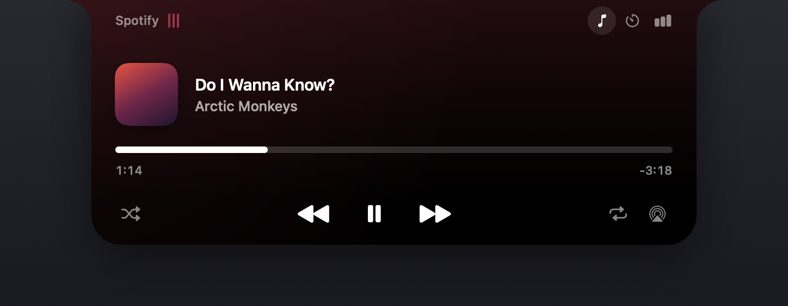
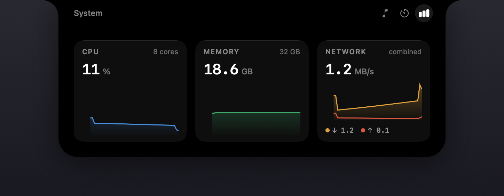
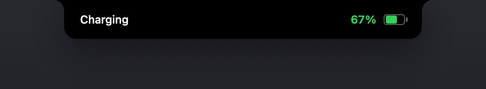

# Cornice

**A media surface that lives in the MacBook notch.**

Cornice turns the camera notch into a Dynamic Island. At rest it is invisible.
Move the pointer onto it and it grows out of the cut-out — album art, track,
artist — and opens into a full transport with a draggable scrubber, timers, and
charted system stats. Charge, volume, network and VPN notices appear there too.

It never takes focus, so clicking it does not pull you out of what you were
doing.

Native Swift 6 and SwiftUI. No Electron, no private APIs, no helper daemon.



---

## What it does

| | |
|---|---|
| **Now Playing** | Apple Music and Spotify: artwork, title, artist, a draggable scrubber, shuffle, repeat, and output device. |
| **System** | CPU, memory and network as filled sparklines over the last 48 samples. |
| **Timers** | Up to four at once, with presets and an alarm. |
| **AirPods** | A live activity when a wireless device connects, with its charge. |
| **System HUDs** | Charging, battery low, full battery, volume, no internet, VPN, downloads — each at its own size. |




---

## Install

Requires macOS 14 or later and a Mac with a notch.

```bash
git clone https://github.com/Kirolosir/Cornice.git
cd Cornice
make run
```

That builds a release bundle into `dist/` and launches it. There is no Dock
icon — the app lives in the menu bar.

The visualiser asks for System Audio Recording permission the first time you
enable it. Everything else works without granting anything.

---

## How it works

### One object that changes size

There is exactly one shape on screen at all times. Resting, peek, activity,
expanded and every HUD are the same view with different geometry, so the surface
reads as the notch growing rather than as a panel appearing.

| State | Size | Bottom radius | Flare |
|---|---|---|---|
| Resting | 209 × 38 | 10 | 0 |
| Peek | 425 × 48 | 16 | 14 |
| Activity | 425 × 54 | 20 | 16 |
| Expanded | 604 × 226 | 28 | 24 |

Three rules carry the look. The **top corners have no radius**, because the top
edge is the physical edge of the screen. The **shoulders are concave coves**, so
extra width appears to grow out of the notch instead of sitting beside it. And
**nothing is drawn inside the notch's own rectangle** — it is a hole in the
display, so short states use the two margins either side of it and tall ones
start below.

The album artwork is drawn once and *travels*: its frame is interpolated along
the same spring as the outline, so it moves outward and down rather than
cross-fading between copies.

### The window never resizes

Resizing an `NSWindow` in step with a SwiftUI animation means the window server
and SwiftUI each animate a different thing at a different cadence, and the result
stutters. The window is created once at its maximum size and never resized; all
motion happens inside it at display rate. Because that window is much larger than
what is visible, `hitTest` returns `nil` outside the drawn shape so it never
swallows clicks meant for the desktop.

### The notch is measured, not looked up

A notch is a fixed number of pixels, but macOS reports displays in points, and
the ratio changes with the scaled resolution you pick in Settings. The same Mac
reports a different notch size depending on a setting you can change at any time.

Cornice measures it from `NSScreen.auxiliaryTopLeftArea` and
`auxiliaryTopRightArea` — the gap between them *is* the notch — and re-measures
on display change, resolution change, rotation and wake.

### Reading what's playing

Cornice talks to Apple Music and Spotify through macOS's own scripting
interfaces and uses no private frameworks.

The obvious route is closed: `MediaRemote` is the private framework most notch
utilities use, and since macOS 15.4 Apple gates it on the caller's platform
signature — a third-party app gets an empty dictionary. The known workaround is
to load a helper into an Apple-signed binary to inherit privileges it was granted
and you were not. This project does not do that.

What the supported path gives up is browser audio. What it gains is full metadata
and artwork, real transport control, and a binary that will not break on the next
macOS release.

Everything that differs between the two players is normalised in one place:
Spotify reports duration in milliseconds and Music in seconds, Music spells
repeat as `off`/`one`/`all` where Spotify uses a boolean, and AppleScript renders
numbers in the user's locale — so a comma-decimal machine returns `182,813` and a
naive parse puts the playhead at zero for much of the world.

### The visualiser is a real FFT

Audio is captured with a **Core Audio process tap** — the public API added in
macOS 14.2 — then mixed to mono, windowed, transformed with vDSP, folded into
log-spaced bands and run through energy-based onset detection for the beat.

The alternatives are worse: a virtual audio device needs an installer and a
reboot, and ScreenCaptureKit demands full Screen Recording permission to read a
waveform.

Analysis happens in the audio callback and writes into a lock-protected box; the
UI *pulls* the newest frame on its own timer. Pushing observable updates from the
audio thread schedules main-actor work faster than it drains.

macOS hands a tap silence rather than an error when the permission is missing, so
the app checks whether it is hearing anything while music plays and says so
plainly instead of showing dead bars.

---

## Performance

Measured with `./Scripts/measure.sh`, not estimated. Release build, MacBook Air
(M3), surface resting with Spotify open, sampled 40 times over two minutes:

| | |
|---|---|
| CPU, mean | **2.9%** of one core |
| Memory, mean | **14.0 MB** |

Most of that is the AppleScript round-trip to Spotify, which costs roughly
100 ms of CPU per poll and is unavoidable on the supported API — so the cadence
follows what is on screen rather than a fixed rate, and drops sharply when the
panel is closed.

Three rounds of profiling got it there, and two of the three findings were
surprising:

- **The frame counter lived on the root view.** Every tick invalidated the root,
  so SwiftUI re-laid out the entire tree — all four surface states and the two
  modules that are not showing — to move one scrubber. It now lives in an
  observable object that only the handful of views that redraw per frame read.
- **Starting the audio tap blocked launch for 5.2 seconds.** Building a process
  tap, an aggregate device and an IO proc ran on the main actor, so the surface
  ignored the pointer for five seconds after login and every other event source
  was queued behind it. It runs on a detached task now.
- **The frame timer ran whenever music played**, including for a resting surface
  showing a title that only changes between tracks. It now runs only when
  something on screen genuinely moves.

---

## Built with

Swift 6 with strict concurrency · SwiftUI + AppKit · Core Audio · vDSP · IOKit ·
SystemConfiguration · Network.framework · Carbon hot keys · no third-party
dependencies.

**118 tests** across the pure logic: player reply parsing, playhead
extrapolation, FFT and beat detection, notch geometry for every display
configuration, the HUD size table, preference migration, and subprocess timeout
and cancellation against real processes. No test needs a running music player or
audio permission.

```bash
make test
```

---

## Limitations

- Apple Music and Spotify only; browser audio is invisible for the reason above.
- Built-in display only, not every screen in a multi-monitor setup.
- Ad-hoc signed, so not notarized — and because macOS ties a permission to the
  code signature, **rebuilding invalidates the audio-capture grant**. If the
  visualiser goes quiet after a rebuild, reset it and relaunch:
  `tccutil reset AudioCapture dev.cornice.app`.
- The hot key is fixed at ⌥⌘D.
- Do Not Disturb, AirDrop and Handoff HUDs are drawn but not wired: macOS does
  not publish that state without Full Disk Access or an API that does not exist.
- English only.

---

## License

MIT. See [LICENSE](LICENSE).
