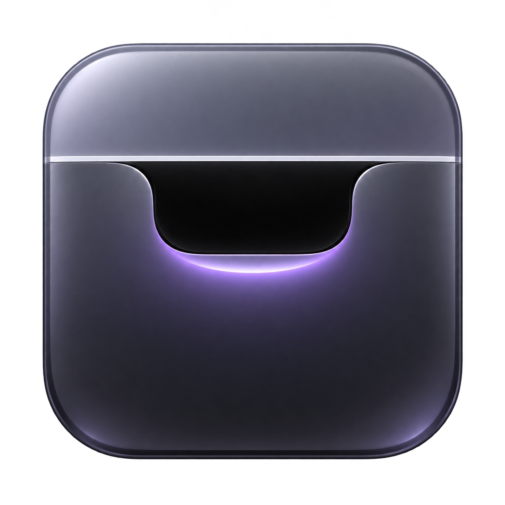
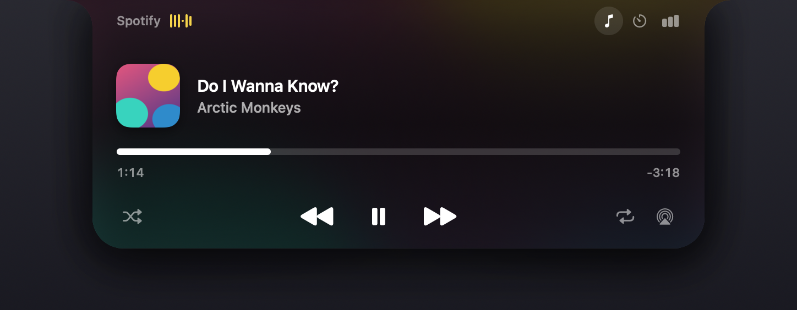
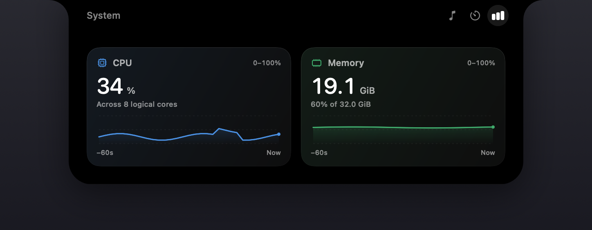

# Cornice



I wanted something like the iPhone's Dynamic Island on my Mac, so I started
Cornice. It sits around the notch and opens when you hover over it. I used
[Atoll](https://github.com/Atoll-Labs/Atoll) as inspiration, especially for how
opening the panel should feel.

The idea is to check your music, timers and system stats without opening another
window. I'm still working on it and polishing the parts that feel off.



## What it does

- Shows Apple Music and Spotify with the cover, song, artist and playback controls.
- Has six visualizer bars that follow captured audio. They stay still when the
  song is paused. With capture off, they only act as a playing indicator.
- Uses the cover's colors for the background, including muted and grey artwork.
- Lets you pause, repeat and add time to a timer. Adding 25 minutes twice gives
  you one 50-minute timer. The alarm keeps ringing until you deal with it.
- Shows CPU and memory readings with charts for the last minute.
- Shows notices for charging, low battery, network and VPN changes, and wireless
  audio devices. Download notices can be enabled in Settings.

Hover only starts inside the notch's measured bounds. It gets measured again
when your display or scaling changes. You can also open the panel with **⌥⌘D**.



## Download

Get the DMG from the [latest release](https://github.com/Kirolosir/Cornice/releases/latest),
open it, and drag Cornice into Applications. The current installer includes the
app icon and is built for Apple silicon.

The app runs on macOS 14 or later. Audio capture needs macOS 14.2 or later.
It's mainly made for MacBooks with a notch. On a display without one, it uses a
small region in the middle of the menu bar.

The app is ad-hoc signed and isn't notarized, so macOS may block the first launch
or call it damaged. For this downloaded copy, you can remove the quarantine flag:

```bash
xattr -dr com.apple.quarantine /Applications/Cornice.app
```

Then try opening it again. Building it yourself is another option.

## Build it yourself

Xcode or the Command Line Tools are enough to build the app.

```bash
git clone https://github.com/Kirolosir/Cornice.git
cd Cornice
make run
```

This builds `dist/Cornice.app` and opens it. Cornice has no Dock icon; settings
and the quit option are in its menu bar item.

To build without opening it:

```bash
make app
```

To package the app after building:

```bash
./Scripts/package-dmg.sh
```

## Permissions

macOS can ask for Automation permission when Cornice talks to Music or Spotify.
Turning on the visualizer asks for System Audio Recording permission. The audio
is analyzed in memory and isn't saved or sent anywhere.

Notifications ask for permission when there's a notice to send. Download
monitoring is off by default because it can ask for access to the Downloads
folder.

Rebuilding the app can affect its audio permission because the signature changes.
If the visualizer can't hear anything, check the Audio Recording settings. The
**Ask again** button in Cornice's settings can reset its own permission.

## Spotify connection

The normal Spotify controls work through AppleScript. Connecting the Web API
lets Cornice use Spotify's own repeat-one setting. Those API playback controls
need [Spotify Premium](https://developer.spotify.com/documentation/web-api/reference/set-repeat-mode-on-users-playback).

1. Create an app in the [Spotify developer dashboard](https://developer.spotify.com/dashboard).
2. Enable Web API and add `cornice://spotify-callback` as the redirect URI.
3. Copy the client ID into **Settings → Spotify**, then click **Connect Spotify**.

The client ID isn't a secret. Sign-in uses PKCE, and the refresh token is saved
in the Keychain. Cornice doesn't ask for your Spotify password.

Without that connection, repeat-one uses a local loop. Crossfade can make that
less reliable than Spotify's own setting. With repeat-one on, Cornice's Next
button restarts the current song; turn repeat off to skip normally.

## Latest fixes

The timer now repeats without creating a new timer, and presets add time to the
current countdown. A paused timer stays paused when more time is added.

Opening the player no longer makes paused music look like it's playing. Silence
from the audio capture also stays still. Here's the [paused player](Docs/images/player-paused.png).

Backgrounds use a blurred copy of the cover and its sampled colors. The tint
slider changes how much of it shows through.

The System tab has a fixed 0–100% chart scale. It uses actual sample times, so
gaps after sleep or slower polling aren't hidden. Memory is shown in GiB, where
one GiB is 1,073,741,824 bytes. Missing readings show a dash. CPU needs two
readings before it can calculate usage.

The low-battery warning triggers at 10% when the battery isn't charging. It
shows both a notch notice and a macOS notification if notifications are allowed.

## Checks

The XCTest suite needs full Xcode; Command Line Tools alone don't include it.

```bash
make test
```

These smaller checks work with Command Line Tools:

```bash
./Scripts/check-audio.sh
./Scripts/check-system.sh
./Scripts/check-battery.sh
```

For timer and appearance checks, use the app bundle so macOS permissions work:

```bash
make app-debug
dist/Cornice.app/Contents/MacOS/Cornice --probe-timers
dist/Cornice.app/Contents/MacOS/Cornice --probe-appearance
```

The timer check plays the alarm for eight seconds and checks repeat, adding time,
overlapping alarms and dismissal. The appearance check covers paused hovering
and artwork colors. Both need a logged-in macOS session.

You can also measure CPU and memory while the app is running with
`./Scripts/measure.sh`, or save screenshots with:

```bash
dist/Cornice.app/Contents/MacOS/Cornice --capture-docs Docs/images
```

The screenshots use preview data and sample artwork.

## Code layout

`CorniceKit` holds the timer, audio, media and system logic. `CorniceApp` holds
the views, app state and window setup. The project uses Swift 6, SwiftUI and
AppKit, with no third-party packages.

```text
Sources/
  CorniceKit/
    Audio/        Capture, FFT and visualizer levels
    Focus/        Timer state and timer board
    Media/        Music and Spotify controls, plus Spotify sign-in
    Notch/        Display and notch measurements
    Telemetry/    CPU, memory and battery readings
    System/       Network, VPN and download notices
    Settings/     Preferences and migrations
    Process/      Process runner and tool lookup
    Support/      Logging, errors and formatting
  CorniceApp/
    Views/        Player, timers, System tab and notices
    Model/        App state and actions
    Window/       Panel placement, hover and shortcut
    Design/       Colors, fonts and animations
    Diagnostics/  The --probe checks
Tests/
  CorniceKitTests/
```

## Still to work on

Browser audio can drive the visualizer, but the app can't get its song title or
cover. Track information is limited to Music and Spotify.

The panel chooses one display. There's no separate panel on every monitor.
Do Not Disturb, AirDrop and Handoff layouts exist, but their automatic triggers
aren't connected yet. The shortcut is fixed, and the interface is English only.

## Credit and license

Thanks to [Atoll](https://github.com/Atoll-Labs/Atoll) for the inspiration, and to
Apple for the Dynamic Island idea.

Cornice is MIT licensed. See [LICENSE](LICENSE).
